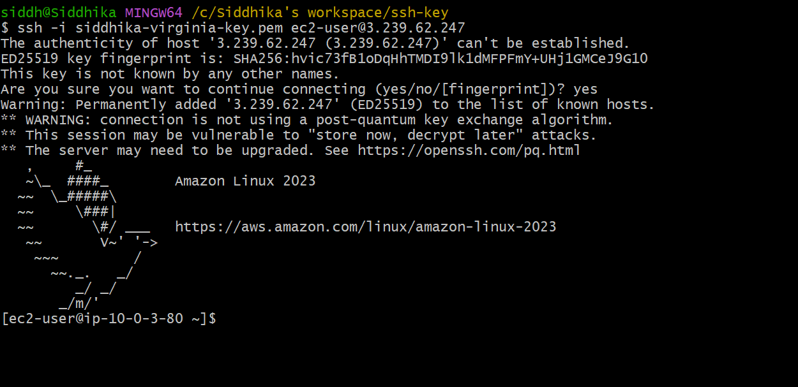

# Design and Implementation of a Secure AWS VPC Architecture with Public and Private Subnets

## Introduction

This project demonstrates the design and implementation of a secure, production-grade **AWS Virtual Private Cloud (VPC)** architecture featuring multi-tier network isolation. 

The primary objective is to build a foundational cloud networking setup that enforces best security practices:
- **Public Subnet:** Hosts internet-facing resources (App Server) accessible via an Internet Gateway (IGW).
- **Private Subnet:** Isolates backend resources (DB Server) without direct internet exposure to ensure maximum security and network protection.

By configuring custom Route Tables, Security Rules, and EC2 instances, this project highlights key AWS networking principles including traffic routing, subnet segregation, and workload protection.

## Architecture Diagram

##  Architecture Explanation

The architecture represents a secure, standard **2-Tier AWS VPC Network Design** dividing web/application resources from sensitive database workloads.

### Key Components & Traffic Flow

1. **Virtual Private Cloud (VPC)**
   - Acts as an isolated, custom-defined virtual network environment within the AWS Cloud.

2. **Public Subnet (Application Tier)**
   - **Host:** Houses the Public EC2 Instance (App Server).
   - **Connectivity:** Associated with a Public Route Table that routes external traffic (`0.0.0.0/0`) via the attached **Internet Gateway (IGW)**.
   - **Purpose:** Allows end-users to securely access web-facing services over the internet.

3. **Private Subnet (Database Tier)**
   - **Host:** Houses the Private EC2 Instance (DB Server).
   - **Connectivity:** Associated with a Private Route Table with no direct route to the Internet Gateway.
   - **Purpose:** Ensures complete network isolation for sensitive backend data and databases, preventing direct internet access.

4. **Internet Gateway (IGW) & Route Tables**
   - **Internet Gateway:** Acts as the communication bridge between the VPC and the public internet.
   - **Public Route Table:** Directs inbound and outbound internet traffic specifically for the Public Subnet.
   - **Private Route Table:** Restricted strictly to internal VPC communication.

## Project Implementation

### Step 1: Create VPC

Created a custom Virtual Private Cloud (VPC) to provide an isolated and secure networking environment for AWS resources.

### Step 2: Create Public and Private Subnets

Created two subnets inside the VPC:
- Public Subnet
- Private Subnet

The Public Subnet is designed for internet-facing resources, while the Private Subnet securely hosts internal resources without direct internet access.

### Step 3: Launch EC2 Instances

Created two EC2 instances:
- App Server in the Public Subnet
- DB Server in the Private Subnet

### Step 4: Create Internet Gateway

Created an Internet Gateway (IGW) to enable internet connectivity for resources inside the VPC.

### Step 5: Attach Internet Gateway to the VPC

Attached the Internet Gateway to the Demo-VPC, allowing the VPC to communicate with the internet.

### Step 6: Configure the Route Table

Used the default route table as the Public Route Table and added the following route:
- Destination: 0.0.0.0/0
- Target: Internet Gateway
This configuration enables outbound internet access for the Public Subnet while keeping the Private Subnet isolated.

### Step 7: Verify Network Connectivity

Verified that the App Server in the Public Subnet has internet connectivity, while the DB Server in the Private Subnet does not have direct internet access, ensuring a secure network architecture.

## 📌 Executive Summary

This project successfully demonstrates the end-to-end design, implementation, and deployment of a secure, production-ready **AWS Virtual Private Cloud (VPC)** architecture. 

### Key Highlights & Technical Accomplishments:
- **Multi-Tier Network Architecture:** Designed and implemented isolated **Public** and **Private** Subnets within a custom VPC boundary to separate internet-facing services from sensitive backend infrastructure.
- **Traffic Routing & Internet Access:** Provisioned and attached an **Internet Gateway (IGW)** alongside customized Route Tables to allow controlled inbound/outbound traffic for public instances while strictly blocking direct internet access for backend instances.
- **Workload Isolation & Security:** Launched EC2 instances across both subnets—verifying that web servers remain publicly accessible while database instances stay fully secure and reachable only within the internal VPC network.
- **Infrastructure Best Practices:** Adhered to AWS cloud security and networking standards, establishing a solid foundation for scalable, multi-tier cloud applications.